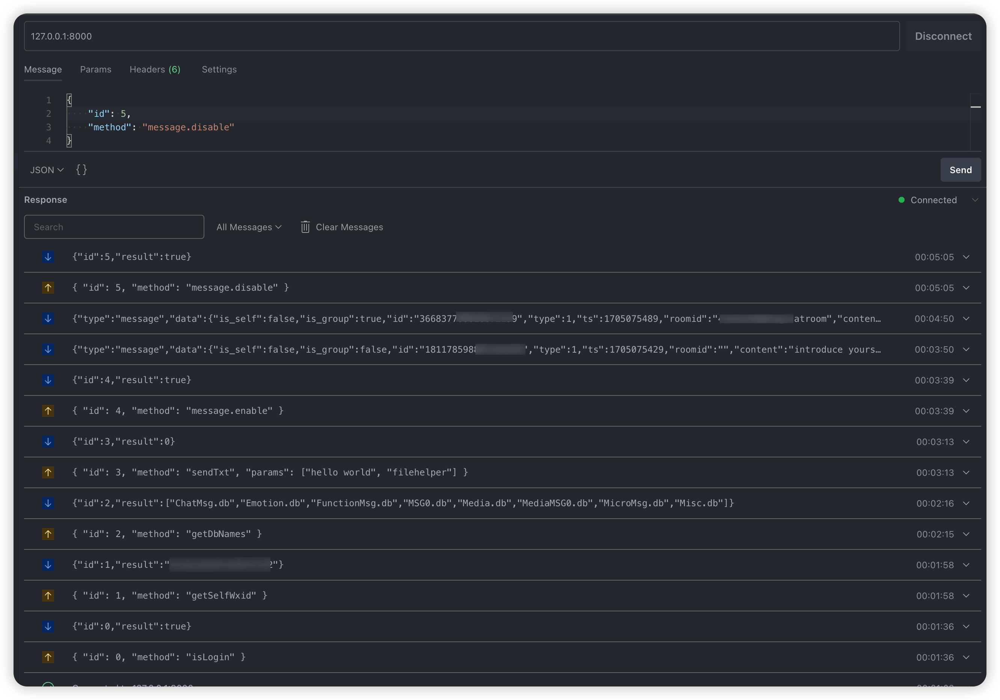

# @wcferry/ws

A Wcferry websocket server



## Usage

### Standalone

Start a standalone websocket server at 8000:

```ts
await WcfWSServer.start({ port: 8000 });
```

### Attach to existing Wcferry instance

```ts
const wcferry = new Wcferry();
new WcfWSServer(wcferry, { port: 8000 });
// impl your bot logic ...
```

## Message definiton

### General commands:

```ts
interface Command {
    id: number; // message unique id (server will response the command with the same id)
    method: string; // the allowed method name, to invoke wcferry.[method](...params)
    params?: any[]; // the parameters of the method call
}
```

methods and params are same as methods in [@wcferry/core](../core/src/lib/client.ts)

All the supported commands:

```ts
[
    'acceptNewFriend',
    'addChatRoomMembers',
    'dbSqlQuery',
    'decryptImage',
    'delChatRoomMembers',
    'downloadAttach',
    'downloadImage',
    'forwardMsg',
    'getAliasInChatRoom',
    'getAudioMsg',
    'getChatRoomMembers',
    'getChatRooms',
    'getContact',
    'getContacts',
    'getDbNames',
    'getFriends',
    'getMsgTypes',
    'getOCRResult',
    'getSelfWxid',
    'getUserInfo',
    'inviteChatroomMembers',
    'isLogin',
    'receiveTransfer',
    'refreshPyq',
    'revokeMsg',
    'sendFile',
    'sendImage',
    'sendPat',
    'sendRichText',
    'sendTxt',
];
```

### Special commands

Following commands can control whether receving messages including pyq messages:

```ts
// enable receiving message:
interface EnableMessage {
    id: number;
    method: 'message.enable';
}

// disable receiving message:
interface DisableMessage {
    id: number;
    method: 'message.disable';
}

// set if receiving pyq message:
interface SetRecvPyq {
    id: number;
    method: 'recvPyq';
    params: [boolean];
}
```

## Server response

### Command response

1. ok:

```ts
interface OKResp {
    id: number;
    result: any;
}
```

2. error:

```ts
interface ErrorResp {
    id: number;
    error: { message: string; code?: number };
}
```

### Message response

Once we enable receiving message, the websocket server will start to push the chat messages back:

```ts
interface Message {
    type: 'message';
    data: WxMsg;
}
```

## Building

Run `nx build ws` to build the library.

## Running unit tests

Run `nx test ws` to execute the unit tests via [Vitest](https://vitest.dev/).
